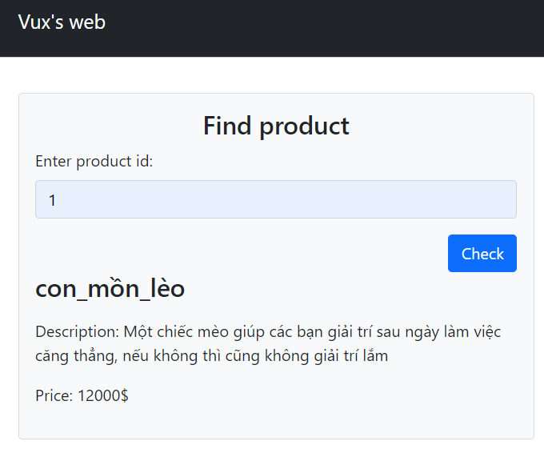
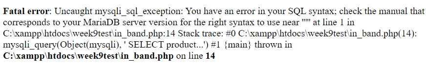
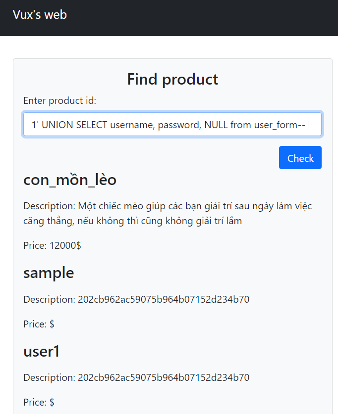

# I. Khái niệm SQL Injection
* Là kỹ thuật lợi dụng những <strong style="color: #ca853c;">lỗ hổng về câu truy vấn</strong> _(query)_ của các ứng dụng/website để tác động, khai thác DB
* Kiểu tấn công này có thể được thực hiện bằng cách <strong style="color: #ca853c">"tiêm" SQL</strong> thông qua (thường là) các ô nhập <strong style="color: #ca853c">input</strong> để làm sai lệch đi câu truy vấn ban đầu, từ đó <strong style="color: #ca853c">khai thác</strong> được dữ liệu từ DB
* Được xếp trong <strong style="color: #ca853c">top đầu</strong> các lỗ hổng bảo mật web phổ biến (OWASP Top 10)

VD: login form, searching field, ...

## Nguyên nhân dẫn đến lỗ hổng SQL Injection:
* Code ẩu
    * Thường là do việc tạo các câu truy vấn bằng cách <strong style="color: #ca853c">ghép chuỗi</strong>
    * Sử dụng trực tiếp input người dùng mà không sanitize nó

## Ảnh hưởng của lỗ hổng SQL Injection:
* Vượt qua khâu <strong style="color: #ca853c">xác thực người dùng</strong>
* Xem được dữ liệu người dùng hoặc các <strong style="color: #ca853c">thông tin quan trọng</strong> khác, thậm chí có thể thay đổi dữ liệu _(update, insert, delete)_
* <strong style="color: #ca853c">Kiểm soát</strong> máy chủ DB

## Bắt nguồn từ Remote Code Execution (RCE):
* Định nghĩa: thực hiện code bẩn từ xa 

   

# II. Phân loại và cách khai thác
1. In-band SQLi (kiểu classic)
* Sử dụng <strong style="color: #ca853c">cùng một kênh liên lạc</strong> để thực hiện cuộc tấn công, thu nhập thông tin
* Phổ biến nhất
* Có 2 biến thể khác:
    * Error-based SQLi: 
        * Tận dụng <strong style="color: #ca853c">error messages</strong> trả về từ DB để lấy thông tin về structure của DB đó
        * Cách khai thác: lợi dụng Numeric Overflow (tràn số); nhập các ký tự đặc biệt (nháy đơn, nháy kép, ...)
        
VD: Đây là một chiếc web với chức năng tìm kiếm sản phẩm bình thường:

        
        
- Nhập bình thường vẫn hiện kết quả

        
- Nhập ký tự đặc biệt (sử dụng dấu nháy đơn) thì hiện lỗi

        
        
=> Từ chiếc thông báo lỗi này có thể khai thác được nhiều thứ khác (hệ DB đang sử dụng, version, câu query, etc.)

    * Union-based SQLi:
        * Tận dụng <strong style="color: #ca853c">toán tử UNION</strong> trong SQL để kết hợp kết quả của nhiều SELECT queries thành 1 kết quả trả về (dùng để lấy data từ table khác)
        * Cách khai thác: 
            * Có thể lấy được số cột kết quả trả về của query bằng cách UNION SELECT NULL (nhưng có cách đơn giản hơn là dùng ORDER BY)
            * Có thể lấy được data type của cột bằng cách thử dữ liệu khi UNION SELECT 
            * Có thể lấy được thông tin về cơ sở dữ liệu, từ đó lấy được thông tin về các bảng/cột trong nó thông qua các bảng về metadata có sẵn
        
VD: Vẫn ở cái web bên trên, ta có thể lấy được thêm cả dữ liệu từ bảng khác thông qua vài bước (ở đây skip đến bước cuối cùng là lấy được bảng và cột)
        
  
2. Inferential SQLi (Blind SQLi)
* Là kiểu tấn công được sử dụng khi mục tiêu (ứng dụng/website) đã ẩn đi chức năng hiện thông báo lỗi nhưng vẫn không chịu vá lỗ hổng đấy
* Có 2 biến thể khác:
    * Content-based BSQLi: thực hiện các <strong style="color: #ca853c">truy vấn kiểu Boolean</strong> (payloads), sau đó phân tích các phản hồi trả về từ DB
    * Time-based BSQLi: thực hiện các truy vấn buộc DB phải <strong style="color: #ca853c">chờ một thời gian</strong> trước khi thực hiện một truy vấn nào đó (thường thông qua _sleep()_)
* Nhược điểm: tốn thời gian
  
3. Out-of-band SQLi
* Kẻ tấn công không nhận được phản hồi từ mục tiêu trên cùng kênh liên lạc nhưng vẫn để mục tiêu gửi dữ liệu đến một nơi nào đó kiểm soát được
* Chỉ hữu hiệu nếu server có command có thể kích hoạt DNS hoặc HTTP request => ít phổ biến hơn

   

# III. Các phương pháp:
Có thể tiếp cận theo nhiều khía cạnh khác nhau, nhưng có 2 khía cạnh chính:
1. Black-box Testing Perspective:
* Định nghĩa: không được cho bất kỳ thông tin nào về mục tiêu, ngoài cái URL
* Cách khai thác: 
    * Ánh xạ các chức năng có thể khai thác được (đi qua các pages có thể truy cập được, xem các input có khả năng bị SQLi, kiểm tra tính logic, xem các subdomains và directories)
=> Có thể dùng tool để scan/crawl thông tin nhưng những tool này chỉ dùng với những lỗ hổng mức độ thấp; để tìm lỗ hổng nghiêm trọng (và chính xác hơn) thì nên tự crawl
    * Fuzzing: tìm lỗi bằng các payloads, xem mục tiêu phản hồi những gì => chủ động hơn, khác với các tools chỉ nhập input chứ không xác định được output
    * Nếu mục tiêu không hiển thị lỗi thì test các Boolean conditions hoặc dùng time delay
    * Soạn gửi OAST payloads để check tương tác khác kênh liên lạc
2. White-box Testing Perspective:
* Định nghĩa: được cho thông tin về mục tiêu cũng như source code của back-end

   

# IV. Cách phòng chống
* Sử dụng Prepared Statements (Parameterized Queries) thay vì nối chuỗi: xác định những vị trí chắc chắn sẽ là chỗ điền input
* Whitelist input validation: list các input hợp lệ, các input khác coi là ko hợp lệ
* Luôn <strong style="color: #ca853c">sanitize/validate input</strong> để kiểm tra input nhập từ người dùng
* mysqli_real_escape_string?
* <strong style="color: #ca853c">Hủy</strong> chức năng <strong style="color: #ca853c">thông báo lỗi</strong> trên live site, hoặc được chuyển hướng sang một file/site khác có những quyền truy cập hữu hạn (để tránh Error-based)
* Có thể thường xuyên <strong style="color: #ca853c">scan web</strong> để tìm lỗ hổng (nguồn: Acunetix)
* Sử dụng các <strong style="color: #ca853c">frameworks</strong> hiện đại đã được test để phòng chống các lỗ hổng (nhưng ko nên tin cậy hoàn toàn)

   

# Video chọc và vá:
1. [In-band](https://drive.google.com/drive/folders/1elBdx-1phU1WtuagIvO-EuH7gohD8830?usp=sharing)
2. Blind

   

# Một số tools:
1. sqlmap: https://github.com/sqlmapproject/sqlmap
2. WAVS(Acunetix, PortSwigger, etc.)

   

# Tài liệu tham khảo:
* Các khái niệm chung, phần mở đầu:

    * https://www.w3schools.com/sql/sql_injection.asp
    * https://portswigger.net/web-security/sql-injection
    * https://owasp.org/www-community/attacks/SQL_Injection
    * https://www.acunetix.com/websitesecurity/sql-injection/
    * https://www.imperva.com/learn/application-security/sql-injection-sqli/
    * https://topdev.vn/blog/sql-injection/
    * https://viblo.asia/p/sql-injection-la-gi-co-bao-nhieu-kieu-tan-cong-sql-injection-m68Z0QnMlkG

 

* Phân loại SQLi:
    * https://www.acunetix.com/websitesecurity/sql-injection2/
    * https://www.acunetix.com/websitesecurity/blind-sql-injection/ (Blind SQLi)
    * https://www.acunetix.com/blog/articles/blind-out-of-band-sql-injection-vulnerability-testing-added-acumonitor/ (Out-of-band SQLi)
